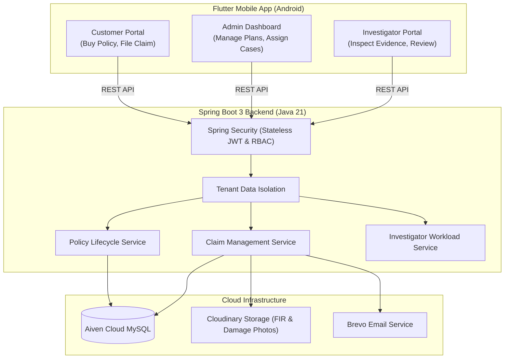

# 🛡️ FraudGuard — Automated Insurance Claim Fraud Investigator

[](https://flutter.dev)
[](https://www.oracle.com/java/)
[](https://spring.io/projects/spring-boot)
[](https://www.mysql.com/)
[](https://www.docker.com/)
[](https://github.com/viveknarawade/Automated-Insurance-Claim-Fraud-Investigator/releases/latest/download/app-release.apk)

FraudGuard is an enterprise, multi-tenant automated insurance claim management and fraud investigation platform. Built with **Spring Boot 3 (Java 21)** on the backend and **Flutter** on Android mobile, it automates the full motor policy lifecycle, incident claim filing, and investigator casework.

---

## 📱 Download Android APK (Live Demo)

Interviewers and recruiters can download and install the release APK directly on an Android device:

👉 **[Download FraudGuard Android APK (v1.0.0)](https://github.com/viveknarawade/Automated-Insurance-Claim-Fraud-Investigator/releases/latest/download/app-release.apk)**  
*(File size: ~56.9 MB, built with release tree-shaking and minification)*

---

## 🔑 Demo Login Credentials

You can test all 3 roles using these pre-configured credentials:

| Role | Email | Password | Tenant | Capabilities |
| :--- | :--- | :--- | :--- | :--- |
| **Admin** | `admin@fraudguard.com` | `admin123` | `TATA_AIG` | Create insurance plans, view all claims, assign investigators |
| **Investigator** | `investigator01@fraudguard.com` | `investigator123` | `TATA_AIG` | Review assigned claims, inspect evidence photos/FIRs, submit fraud reports |
| **Customer** | `customer@fraudguard.com` | `customer123` | `TATA_AIG` | Browse plans, activate vehicle policies (MH-12-AB-1234), file claims |

> **Note:** The backend is deployed live on Render: `https://fraudguard-backend-g3e4.onrender.com`. (Free tier backend may take 30-45 seconds to spin up on cold start).

---

## 🏗️ System Architecture



---

## ✨ Key Features

### 1. Multi-Tenant Architecture & RBAC
* Complete data isolation per insurance tenant (`TATA_AIG`, `MAHI`, `MSIL`).
* Stateless JWT authentication with `@PreAuthorize` method security.

### 2. Motor Policy Lifecycle
* **Admin Master Plan Catalog**: Admins configure coverage limits (IDV) and annual premiums.
* **Vehicle Policy Activation**: Customers apply a plan to a specific vehicle registration number and make/model.
* **Duplicate Purchase Prevention**: Rejects duplicate active policy purchases for the same vehicle/plan.
* **Policy-Gated Claims**: Customers can only file a claim against an active, verified vehicle policy.

### 3. Investigation & Fraud Detection
* **Real-Time Workload Tracking**: Admins view active investigator caseloads to balance assignments.
* **Evidence Document Inspection**: In-app image previewers and PDF viewers for accident photos and police FIRs stored securely on Cloudinary.
* **Structured Review Assessment**: Investigators submit detailed notes and fraud risk classifications (`CLEAR`, `SUSPECTED`, `CONFIRMED`).
* **Admin Gated Decision**: Final claim approval or rejection is gated until investigation review is completed.

---

## 🛠️ Tech Stack

* **Mobile App:** Flutter, Dart, Provider (State Management), Material 3, File Picker, HTTP Client
* **Backend:** Java 21, Spring Boot 3, Spring Data JPA / Hibernate, Spring Security (JWT)
* **Database:** MySQL 8.0 on Aiven Cloud
* **Cloud & DevOps:** Docker, Render, Cloudinary (File Storage), Brevo (Transactional Email API)

---

## 💻 Local Setup & Build

### 1. Run Flutter App
```bash
cd insurance_flutter_app
flutter pub get
flutter run
```

### 2. Build Release APK
```bash
cd insurance_flutter_app
flutter build apk --release
# Output: build/app/outputs/flutter-apk/app-release.apk
```

### 3. Run Spring Boot Backend
```bash
cd insurance-fraud-backend
mvn clean spring-boot:run
```

---

## 👤 Author
**Vivek Narawade**  
* B.Tech in Artificial Intelligence & Data Science, AISSMS IOIT, Pune  
* [LinkedIn](https://www.linkedin.com/in/vivek-narawade-095a6431b/) • [GitHub](https://github.com/viveknarawade)